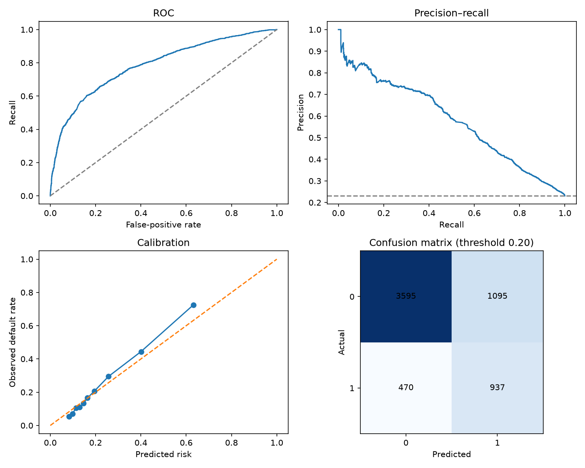
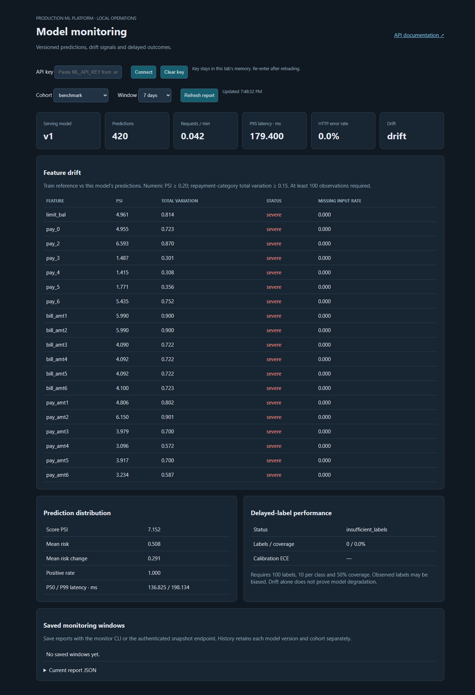
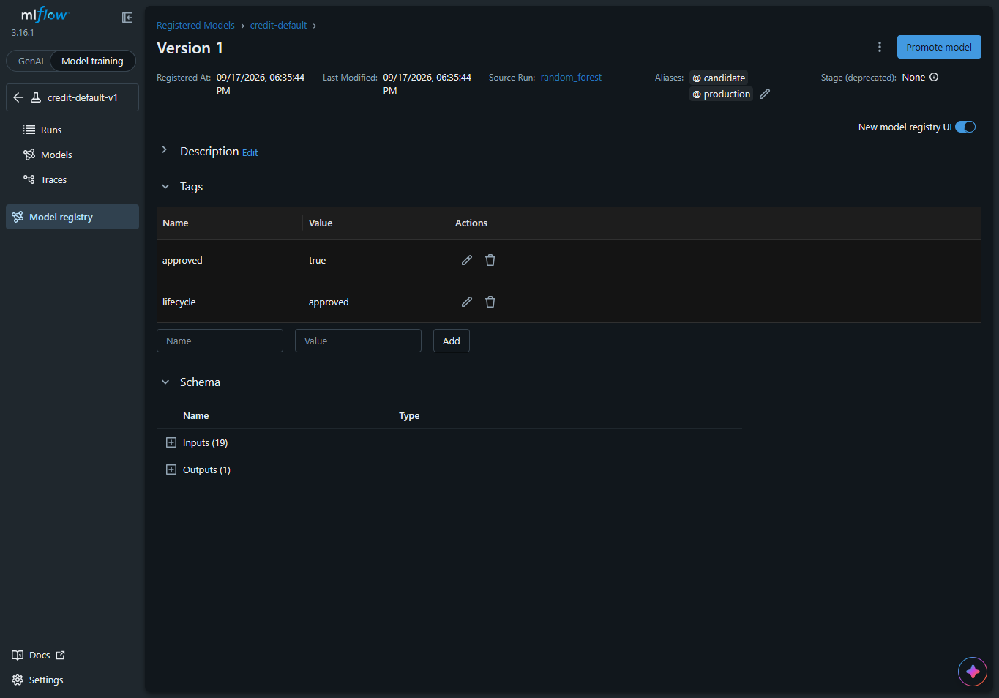
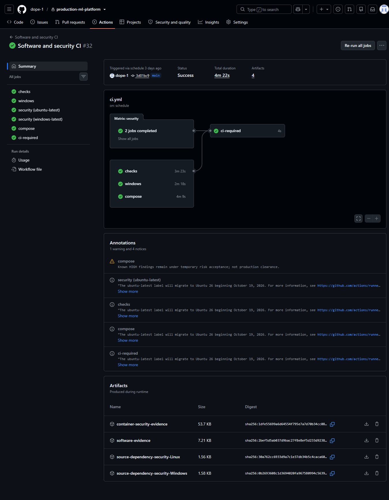

# Production ML Platform

[](https://github.com/dope-1/production-ml-platform/actions/workflows/ci.yml)

A credit-default ML engineering portfolio: reproducible data preparation, model selection,
MLflow tracking, guarded promotion and rollback, authenticated inference, monitoring and
controlled retraining. Built with Python, scikit-learn, LightGBM, FastAPI, PostgreSQL, Docker,
GitHub Actions and Terraform.

**Local platform implemented through Milestone 9; local portfolio evidence captured on
22 September 2026. AWS was partially provisioned; CloudFront account verification was
declined and Milestone 10 remains incomplete.** This historical-data demonstration is not approved for
lending decisions or present-day UAE customer prediction. See the
[deployment status](docs/milestone-10-report.md) and [portfolio checklist](docs/milestone-11-report.md).

## Start the review here

| Question | Evidence |
|---|---|
| How does the system work? | [Architecture and trade-offs](docs/architecture.md) |
| How was the model selected? | [Model card](docs/model_card.md), [training comparison](docs/verification/comparison.json) |
| What does it achieve? | Test ROC-AUC **0.7847**, average precision **0.5801**; [reference evidence](docs/verification/candidate.json) |
| What are its limitations? | [Responsible AI report](docs/responsible_ai.md) |
| How is it monitored? | [Monitoring report](docs/monitoring-report.md) |
| How fast is it? | [Benchmark report](docs/benchmark-report.md), with measurement scope |
| Can I see a demo? | [Local demonstration and screenshot guide](docs/demo-guide.md) |
| How is it secured and deployed? | [Security](SECURITY.md), [AWS guide](docs/milestone-10-guide.md) |

The reviewed [local benchmark](docs/verification/portfolio/benchmark.md) completed 200/200
timed requests with zero errors: P95 **227.17 ms**, throughput **20.49 requests/s**, concurrency 4.
The [monitoring capture](docs/verification/portfolio/monitoring.md) records 210 benchmark
predictions including 10 warmups, drift on repeated example inputs, and no observed labels.
[JSON evidence](docs/verification/portfolio/evidence.json) records the date, client environment
and serving run. These are local HTTP results, not a cloud benchmark or model-quality verdict.

The reference random forest was selected using training-only grouped cross-validation.
Its threshold of 0.20 was selected on validation data. Test recall is 0.6660 and precision
is 0.4611: the recall target comes with substantial false positives. These historical
reference-run results are not estimates of current lending performance.



## Engineering capabilities

- Pinned data and deterministic profile-grouped splits prevent duplicate-profile leakage.
- Six configurations across logistic regression, random forest and LightGBM; the fitted
  preprocessing pipeline is shared by training, HTTP inference and batch scoring.
- MLflow provenance, artifact hashes, validation/comparison gates and a controller audit
  journal. Explicit reload verifies the new snapshot; failure retains the serving champion.
- API/admin roles, strict inputs, request bounds, rate limiting, SHAP reconstruction and
  durable prediction writes before returning success.
- Feature/score drift, delayed-label performance and isolated simulation cohorts. Retraining
  requires new actual labels, preserves holdouts and can reject a challenger.
- Linux/Windows CI, dependency/container security gates and two-phase AWS infrastructure.
  Temporary vulnerability exceptions remain explicit; green CI is not production clearance.

## Run an existing configured checkout

Use Python 3.12 and Docker Desktop with Linux containers. From PowerShell at the repository root:

```powershell
docker compose up --detach --wait
.\.venv\Scripts\python.exe scripts\verify_milestone9.py
```

| Interface | Address |
|---|---|
| Monitoring dashboard | [Local dashboard](http://127.0.0.1:8000/api/v1/dashboard) |
| Development API documentation | [Local API docs](http://127.0.0.1:8000/docs) |
| Private MLflow UI | [Local MLflow](http://127.0.0.1:5000) |

Connect with the local API key in the dashboard's masked field. Select a cohort containing
observations; an empty `live` cohort is a valid empty state. Preserve `.env` and Docker volumes.

Predict with the bundled public example without printing credentials:

```powershell
$headers = @{ 'X-API-Key' = (.\.venv\Scripts\python.exe -c "from ml_platform.core.config import Settings; print(Settings().api_key.get_secret_value())") }
$body = Get-Content examples\predict.json -Raw
Invoke-RestMethod -Method Post -Uri http://127.0.0.1:8000/api/v1/predict -Headers $headers -ContentType application/json -Body $body
Remove-Variable headers
```

Use the [demo guide](docs/demo-guide.md) for explanation, monitoring, screenshots and a
single command to collect actual local benchmark evidence in isolated demonstration cohorts.

## Fresh installation

Create `.venv` with an installed Python 3.12 interpreter. On Windows, `py -3.12 -m venv .venv`
works when that interpreter is registered with the launcher. Then run sequentially, stopping
on any failure:

```powershell
.\.venv\Scripts\python.exe -m pip install -r requirements-dev.lock
.\.venv\Scripts\python.exe -m pip install --no-deps -e .
.\.venv\Scripts\python.exe -c "from pathlib import Path; import secrets; p=Path('.env'); assert not p.exists(), 'Keep the existing .env'; p.write_text(Path('.env.example').read_text().replace('ML_DB_PASSWORD=', 'ML_DB_PASSWORD=' + secrets.token_hex(24)))"
.\.venv\Scripts\python.exe scripts\upgrade_milestone9.py --configure-only
.\.venv\Scripts\python.exe scripts\upgrade_and_verify.py
.\.venv\Scripts\python.exe scripts\upgrade_batch2.py
```

These setup commands install dependencies, prepare data, train/register the initial model and
build services. Review rejected promotions; never weaken gates to force a demo. Keep an existing
`.env`, registry state and volumes. On Linux use `.venv/bin/python`. Detailed upgrade instructions:
[Milestones 6–8](docs/batch-2-guide.md), [Milestone 9](docs/milestone-9-guide.md).

## AWS architecture and status

The target public path is CloudFront HTTPS on an AWS-provided domain, then an ALB restricted
to CloudFront origin addresses and a secret origin header, then one ECS/Fargate task.
CloudFront-to-ALB uses HTTP. RDS PostgreSQL uses verified TLS; encrypted EFS holds MLflow
SQLite metadata/artifacts. ECR, private S3, Secrets Manager and CloudWatch support deployment.
This design uses the AWS-provided domain, but is blocked on this account by the declined
CloudFront verification. No alternative public deployment has been implemented or verified.

One task matches the SQLite registry and in-memory limiter; this is not a highly available
serving fleet. A partial apply is not a working deployment. The actual HTTPS verifier must pass
before deployment status changes. See the [AWS guide](docs/milestone-10-guide.md).

## Repository map

| Location | Responsibility |
|---|---|
| `src/ml_platform/data`, `features`, `training` | Validated data, deterministic features, model selection/evaluation |
| `src/ml_platform/models`, `inference` | Registry, verified loading, predictions, explanations and batch scoring |
| `src/ml_platform/api`, `db`, `core` | HTTP/security, persistence and configuration |
| `src/ml_platform/monitoring`, `retraining`, `observability` | Drift, labels, challengers, metrics and logs |
| `configs`, `examples`, `scripts` | Policy, public inputs and operational commands |
| `tests`, `.github/workflows` | Unit/integration/lifecycle checks and software/security/model workflows |
| `deploy/aws/terraform` | AWS source; state and private variables stay out of Git |
| `docs/verification` | Explicitly scoped, publishable reference evidence |

Data: [UCI provenance and attribution](data/README.md). License: [LICENSE](LICENSE).
Secrets, live state and private artifacts are excluded from Git. Check each measurement's
scope before comparing results.
## Demonstration screenshots

Local monitoring of benchmark traffic. Repeated example inputs can trigger
drift; missing outcome labels prevent predictive-quality assessment.



Registered model and source-run details.



Successful software and security CI for the commit shown.

