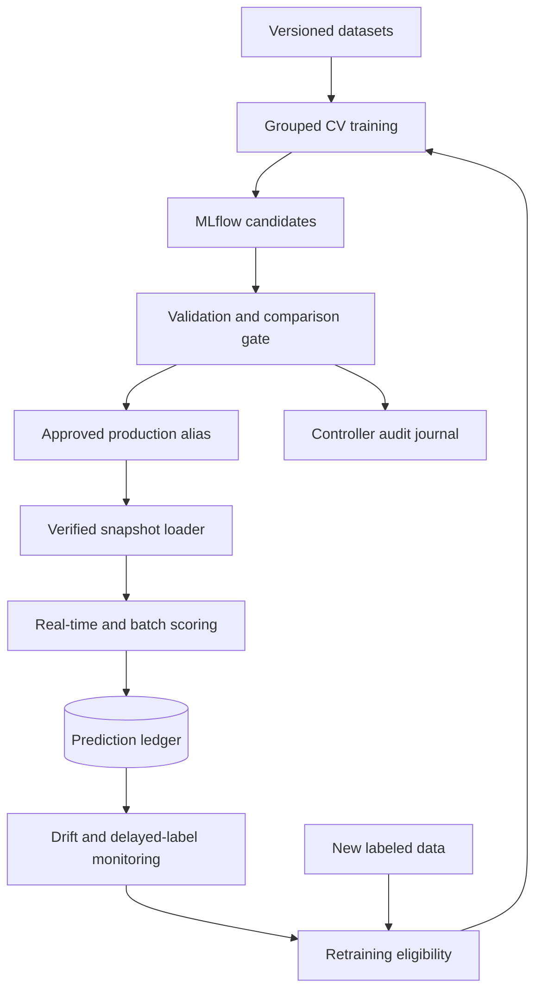

# Architecture through Milestone 8

Training runs in a host CLI/job process, never in an HTTP handler. MLflow in
Docker uses a SQLite metadata store and proxies artifact files over HTTP. That
small local backend is separate from the API's PostgreSQL observation store.
Both volumes survive ordinary Compose restarts. Alembic runs before API startup.

The controller serializes mutations with FileLock and journals alias changes
before applying them. The serving process mounts that directory read-only to
respect pending operations without rebinding the controller's host tracking URI
to Docker's internal URI. Both point to the same trusted MLflow server. Approval,
run provenance, source schema/code hashes and every artifact file are checked
before deserialization. The monitoring reference is separately checksummed and
bound to the same run and dataset. Batch 1 artifacts remain compatible.

An immutable model/reference snapshot is loaded once. A request captures that
snapshot, so scoring, explanation, bucketing and recorded version stay together
if a reload occurs concurrently. Reload builds the replacement fully before
switching the pointer and verifies that the alias did not change during loading.
A failed reload retains the current snapshot; cold-start readiness requires both
the prediction schema and a loaded model. Existing snapshots remain available
during registry outages. This is explicit operator-controlled rollout, with no
automatic cross-worker synchronization; Compose runs one Uvicorn worker.

Predictions are committed before success responses. The database stores version,
score, class, timestamp, coarse feature buckets and eventual labels. Customer IDs
remain in user-managed batch outputs. Raw features and demographic audit columns
are not stored in this ledger. Reused request IDs do not collide with unique
prediction IDs. Label updates are transactional, row-locked and immutable.

Monitoring isolates each model version, observation cohort and prediction-time
window. Labels are included as of report creation; coverage and class support
are explicit. Numerical PSI and categorical total variation have effect-size
thresholds. Drift is separate from performance degradation. Insufficient evidence
never triggers a drift/performance retraining job. The dashboard reports real DB
observations, while Prometheus exposes operational counters/histograms.

New retraining features/labels arrive through a separately validated CSV. The
pipeline rejects overlapping IDs or holdout predictor profiles, extends only
training, preserves validation/test bytes and does not evaluate test. The current
champion is re-read under the promotion lock. Every challenger must pass the
existing absolute and comparison gates; deployment requires an explicit serving
reload. Test/demo policies and synthetic observations are isolated from the live
registry and monitoring cohort.

Secrets live in environment configuration; versioned policy contains no secrets.
The distributed archive excludes local credentials, virtual environments,
controller state, generated data and live model artifacts. All Docker ports bind
to loopback. This design is a single-controller local platform; authentication,
network ingress, scanning and cloud deployment remain the next batch.
