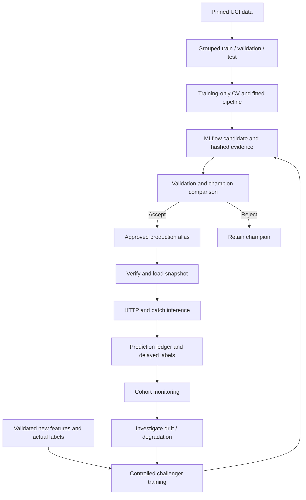
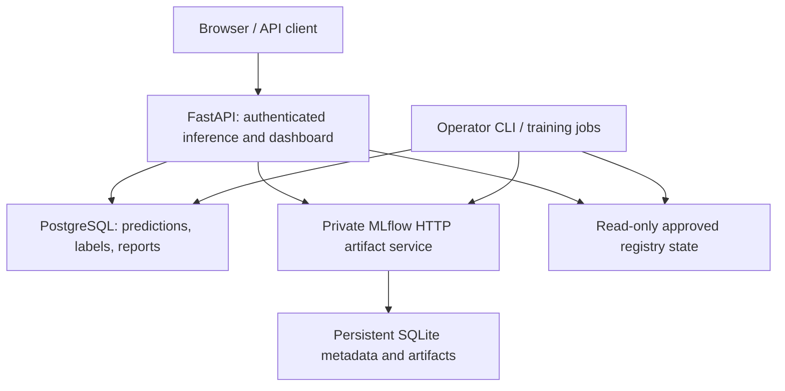
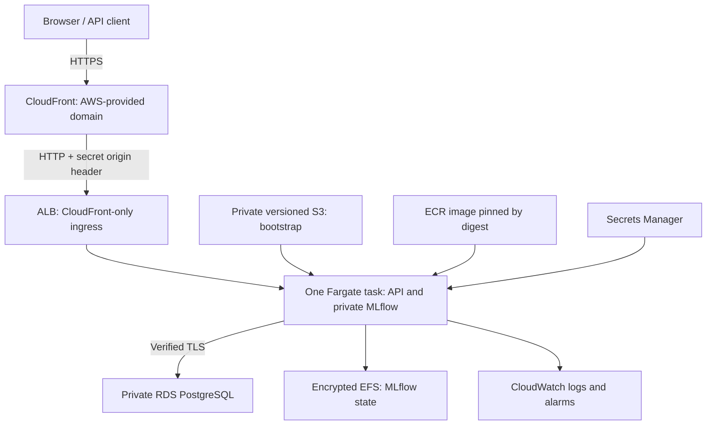

# Architecture and engineering trade-offs

## Model lifecycle

Training runs in a CLI/job process, never an HTTP handler. Promotion and rollback use a
serialized controller and audit journal. A request captures one snapshot so score, explanation,
buckets and version agree. Reload verifies the replacement before switching; failure retains
an existing snapshot. No automatic cross-worker synchronization is implemented.

Profile groups remain within one data partition. Retraining extends training only, preserves
validation/test bytes and does not evaluate test. Repeated validation decisions still require
independent governance; fixed holdouts alone do not prevent eventual selection overfitting.

## Local runtime

Compose publishes API 8000, MLflow 5000 and PostgreSQL 5432 on loopback. API/admin keys protect
data/mutation routes. Authentication and request bounds precede model/database work. One
Uvicorn worker owns the limiter and snapshot. Predictions commit before success responses.

The ledger retains versions, scores, coarse feature buckets and eventual labels, not raw
features/customer IDs. Batch output can contain supplied IDs and is user-managed. Aggregates
still require protection/retention. Early security rejections appear in Prometheus; not all
reach the database HTTP-event report.

Prediction monitoring uses model/cohort/time isolation. HTTP events use cohort/time and may
span versions during a rollout. Synthetic, verification and benchmark cohorts cannot supply
live retraining evidence. Drift is an investigation signal, not proof of degradation.

## AWS target deployment

Phase 1 creates infrastructure with serving disabled. Phase 2 starts the task after the image,
model and secrets exist. Bootstrap and migrations precede serving. Authenticated CloudFront
responses are not cached. CloudFront-to-ALB HTTP means this is not end-to-end HTTPS. The
CloudFront prefix list and random header protect origin ingress, subject to production review.

No NAT gateway is used: the task has a public IP for outbound access and restricted inbound
security groups. PostgreSQL stays private. Scaling beyond one task requires redesigning the
SQLite registry, controller coordination and in-memory limiter.

| Decision | Benefit | Limit / future production work |
|---|---|---|
| One task and worker | Simple snapshot, limiter and SQLite ownership | No serving redundancy; shared state needed for scale |
| Explicit reload | Reviewable rollout; failures retain champion | Operator coordination after promotion/rollback |
| Shared API/admin keys | Demonstrable authorization boundary | Per-client identity and rotation governance needed |
| Historical grouped splits | Avoid duplicate-profile leakage | No prospective temporal or UAE external validation |
| Separate process/HTTP benchmarks | Honest latency attribution | No capacity guarantee or cloud SLA |
| Fail-closed security checks | Blocks unknown/unaccepted findings | Temporary HIGH exceptions remain explicit risks |

See [Milestone 10 status](milestone-10-report.md) for actual provisioning evidence. Secrets,
Terraform state, backups and raw runtime configuration are never portfolio assets.
