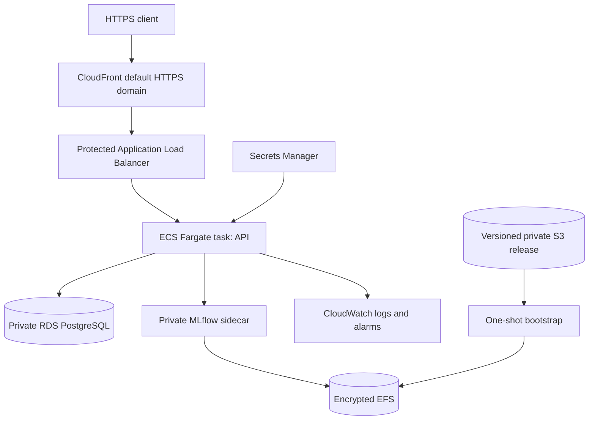

# Milestone 10: AWS deployment guide

> Archived deployment reference: AWS deployment was discontinued and the partial stack removed on 24 September 2026. The completed portfolio runs locally. These commands can recreate billable infrastructure.

This is the reference cloud deployment for model version 1. It is designed for a low-traffic
portfolio environment, not a multi-region or horizontally scaled production service. Terraform
creates billable resources, so read the cost and teardown sections before applying it.

## Architecture and boundaries



- CloudFront supplies the AWS-owned `*.cloudfront.net` HTTPS endpoint, so this deployment needs no
  purchased domain, Route 53 zone, or ACM certificate.
- The ALB origin accepts HTTP only from AWS's CloudFront origin-facing network. Its default action
  is `403`; forwarding additionally requires a generated `X-Origin-Verify` header held in Terraform
  state and the CloudFront configuration. End-user traffic is always redirected to HTTPS at the
  CloudFront edge.
- The task receives a public IP only for outbound AWS API/image access, avoiding a NAT Gateway.
  Its security group accepts port 8000 only from the ALB security group.
- RDS and EFS use isolated subnets and accept traffic only from the task security group.
- MLflow has no load-balancer listener. It is reachable only inside the task at localhost:5000.
- The API, migration, MLflow, and bootstrap containers run as UID 10001 with read-only roots and
  writable task-scoped `/tmp` volumes. One short-lived init container runs as root only to assign
  those empty volumes to UID 10001; it receives no secrets, EFS mount, listener, or application data
  and must exit successfully before bootstrap begins.
- The release image is addressed by an ECR digest. ECR tags are immutable and scan on push.
- API/admin keys and the RDS-generated password are injected from Secrets Manager. Values are not
  accepted as Terraform inputs and therefore do not enter Terraform state.
- The RDS global CA bundle is pinned by SHA-256 in the release manifest and PostgreSQL uses
  `verify-full` hostname/certificate validation.

The service intentionally runs exactly one task. The current rate limiter is process-local and the
MLflow backend is SQLite, so increasing desired count would produce inconsistent rate limits and
an unsafe multi-writer registry. Horizontal scaling first requires a shared limiter and a managed
MLflow database migration.

The ALB liveness matcher accepts 200-499 because ALB health checks use a target-IP `Host` header,
which the application's strict hostname policy rejects with 400. ECS independently checks `/ready`
through localhost and will not mark the API healthy until PostgreSQL and model v1 are available.

## Required inputs

Do not proceed until all of these are available:

1. An AWS account and AWS CLI v2 session with permission to create VPC, CloudFront, ECS, ECR, RDS,
   EFS, S3, Secrets Manager, IAM, CloudWatch, ALB, and Budgets (optional) resources.
2. Terraform 1.8 or newer and Docker Desktop.
3. The successful Milestone 9 security backup directory containing `metadata.json`, `registry/`,
   and `mlflow.tar.gz`.
4. A clean repository and a green `Software and security CI` run on `main`.

For shared or long-lived use, configure a versioned, encrypted remote Terraform backend before the
first apply. Local `tfstate` is ignored by Git but remains sensitive and must be backed up securely.
The reference region is Mumbai (`ap-south-1`). It was selected as the operational fallback after
the AWS console displayed an availability warning for the originally considered UAE region.

## 1. Recheck the release

From the VS Code PowerShell terminal at the repository root:

```powershell
git status --short
gh run list --workflow ci.yml --branch main --limit 3
docker compose ps
.\.venv\Scripts\python.exe scripts\verify_milestone9.py
```

Stop if Git is unexpectedly dirty, CI is red, any container is unhealthy, or the verifier does not
report model version `1`.

## 2. Stage the immutable release

Download the official AWS RDS global bundle and record its digest:

```powershell
New-Item -ItemType Directory -Force .state\aws-input | Out-Null
Invoke-WebRequest https://truststore.pki.rds.amazonaws.com/global/global-bundle.pem `
  -OutFile .state\aws-input\global-bundle.pem
$caHash = (Get-FileHash .state\aws-input\global-bundle.pem -Algorithm SHA256).Hash.ToLower()
```

Replace the backup path with the verified path printed by `upgrade_security.py`:

```powershell
$backup = 'E:\Projects\production-ml-platform\.state\backups\security-REPLACE'
.\.venv\Scripts\python.exe scripts\prepare_aws_release.py `
  --backup $backup `
  --ca-bundle .state\aws-input\global-bundle.pem `
  --ca-sha256 $caHash `
  --output .state\aws-release `
  --model-version 1
```

The command refuses path traversal, links, an empty MLflow database, a pending registry operation,
a mismatched model version, a reused output directory, or a changed CA digest. It produces:

- `.state/aws-release/image/`: derived-image build context with registry controller and CA bundle;
- `.state/aws-release/mlflow/`: extracted MLflow database and artifacts for S3;
- `.state/aws-release/release-manifest.json`: hashes tying the release together.

## 3. Configure and apply phase 1

```powershell
Set-Location deploy\aws\terraform
Copy-Item terraform.tfvars.example terraform.tfvars
code terraform.tfvars
terraform fmt -recursive
terraform fmt -check -recursive
terraform init -upgrade
terraform validate
terraform plan -out milestone10.tfplan
terraform apply milestone10.tfplan
```

Use a placeholder of `sha256:` plus 64 zeros for the first `image_digest`, keep
`deploy_service = false`, and set your budget email. Review the entire plan before approval. Phase
1 creates billable infrastructure but keeps the ECS desired count at zero. The default budget is
USD 5; it sends alerts and is not a hard spending cap.

## 4. Push the release and populate protected inputs

Return to the repository root. These commands obtain Terraform outputs without copying secret
values into command history:

```powershell
Set-Location ..\..\..
$region = 'ap-south-1'
$repo = terraform -chdir=deploy\aws\terraform output -raw ecr_repository_url
$bucket = terraform -chdir=deploy\aws\terraform output -raw bootstrap_bucket
$prefix = terraform -chdir=deploy\aws\terraform output -raw bootstrap_prefix
$registry = ($repo -split '/')[0]

aws ecr get-login-password --region $region | docker login --username AWS --password-stdin $registry
docker compose build --pull ml-api
docker build --build-arg BASE_IMAGE=production-ml-platform-ml-api:latest `
  -t ml-platform-aws:model-v1 .state\aws-release\image
docker tag ml-platform-aws:model-v1 "${repo}:model-v1"
docker push "${repo}:model-v1"
$digest = aws ecr describe-images --region $region --repository-name ($repo -split '/')[-1] `
  --image-ids imageTag=model-v1 --query 'imageDetails[0].imageDigest' --output text

aws s3 sync .state\aws-release\mlflow "s3://${bucket}/${prefix}/" `
  --region $region --sse AES256 --only-show-errors
aws s3 cp .state\aws-release\release-manifest.json `
  "s3://${bucket}/releases/model-v1/release-manifest.json" --region $region --sse AES256
aws s3 ls "s3://${bucket}/${prefix}/" --recursive --region $region
```

Wait for the automatic ECR scan, then inspect it. Do not deploy with unreviewed HIGH or CRITICAL
findings:

```powershell
aws ecr describe-image-scan-findings --region $region --repository-name ($repo -split '/')[-1] `
  --image-id imageDigest=$digest
```

Create independent random keys and put them directly into the pre-created secrets:

```powershell
$apiBytes = New-Object byte[] 32
$adminBytes = New-Object byte[] 32
[Security.Cryptography.RandomNumberGenerator]::Fill($apiBytes)
[Security.Cryptography.RandomNumberGenerator]::Fill($adminBytes)
$apiKey = [Convert]::ToBase64String($apiBytes)
$adminKey = [Convert]::ToBase64String($adminBytes)
$apiSecret = terraform -chdir=deploy\aws\terraform output -raw api_key_secret_arn
$adminSecret = terraform -chdir=deploy\aws\terraform output -raw admin_key_secret_arn
aws secretsmanager put-secret-value --region $region --secret-id $apiSecret --secret-string $apiKey
aws secretsmanager put-secret-value --region $region --secret-id $adminSecret --secret-string $adminKey
```

Store the two keys in your password manager. Never add them to `.env`, Terraform files, screenshots,
issues, or GitHub Actions logs.

## 5. Apply phase 2 and verify

Set the real `$digest` as `image_digest` and change `deploy_service = true` in
`deploy/aws/terraform/terraform.tfvars`, then:

```powershell
terraform -chdir=deploy\aws\terraform plan -out milestone10-service.tfplan
terraform -chdir=deploy\aws\terraform apply milestone10-service.tfplan
$url = terraform -chdir=deploy\aws\terraform output -raw api_url
$env:ML_API_KEY = $apiKey
.\.venv\Scripts\python.exe scripts\verify_aws_deployment.py `
  --base-url $url --expected-model-version 1
Remove-Item Env:\ML_API_KEY
```

The verifier checks real TLS validation, HSTS, production docs being disabled, authentication,
readiness, model identity, and an authenticated prediction. Preserve
`reports/milestone-10-verification.json` as private deployment evidence; it contains no key.

## Operations, rotation and rollback

View service events and sanitized logs:

```powershell
aws ecs describe-services --region $region --cluster production-ml-platform-portfolio `
  --services production-ml-platform-portfolio
aws logs tail /ecs/production-ml-platform-portfolio/api --region $region --since 30m
```

To rotate either application key, add a new Secrets Manager version and force an ECS deployment.
AWS injects updated values only into newly launched tasks.

For an application rollback, find the last known-good task definition and update the service:

```powershell
aws ecs list-task-definitions --region $region `
  --family-prefix production-ml-platform-portfolio --sort DESC
aws ecs update-service --region $region --cluster production-ml-platform-portfolio `
  --service production-ml-platform-portfolio --task-definition REPLACE_WITH_PRIOR_ARN `
  --force-new-deployment
aws ecs wait services-stable --region $region --cluster production-ml-platform-portfolio `
  --services production-ml-platform-portfolio
```

Then rerun `verify_aws_deployment.py`. Task-definition rollback does not reverse a database schema.
Only deploy backward-compatible Alembic migrations; restore RDS/EFS from backups for a data rollback.
The S3 release prefix is versioned and must never be overwritten for a different model release.

## Cost and teardown

CloudFront's AWS-owned hostname removes domain-registration and certificate costs, but it does not
make the full stack permanently free. The main fixed costs are the continuously running Fargate
task, Application Load Balancer, RDS instance/storage/backups, public IPv4 address, and Secrets
Manager secrets. EFS, S3, ECR, CloudFront, CloudWatch, and transfer are usage-based. New-account
credits may absorb eligible usage, but budgets only alert and do not stop resources or guarantee a
zero bill.

For this portfolio deployment, apply, collect verification evidence, and destroy the stack in the
same work session. Do not leave it running overnight. The design omits a NAT Gateway and Multi-AZ
RDS to reduce cost; that also reduces availability. Prices vary by region and change over time, so
use the [AWS Pricing Calculator](https://calculator.aws/) with `ap-south-1` before applying and check
the official pricing pages for [CloudFront](https://aws.amazon.com/cloudfront/pricing/),
[Fargate](https://aws.amazon.com/fargate/pricing/),
[RDS PostgreSQL](https://aws.amazon.com/rds/postgresql/pricing/),
[Application Load Balancing](https://aws.amazon.com/elasticloadbalancing/pricing/), and
[public IPv4](https://aws.amazon.com/vpc/pricing/).

To stop compute charges temporarily, set `deploy_service = false` and apply. ALB, RDS, EFS, and
storage charges continue. For full teardown, first preserve the release manifest, S3 version IDs,
RDS final snapshot, EFS backup recovery point, and Terraform state. Then disable deletion protection
for RDS and ALB in a reviewed plan and run `terraform destroy`. The S3 bucket is `force_destroy =
false`, so deletion remains blocked until its versioned objects are deliberately removed.

## Source documentation

- [AWS RDS TLS and CA bundles](https://docs.aws.amazon.com/AmazonRDS/latest/UserGuide/UsingWithRDS.SSL.html)
- [Amazon ECS with EFS](https://docs.aws.amazon.com/AmazonECS/latest/developerguide/efs-volumes.html)
- [Passing secrets to ECS](https://docs.aws.amazon.com/AmazonECS/latest/developerguide/specifying-sensitive-data.html)
- [Restrict ALB access to CloudFront](https://docs.aws.amazon.com/AmazonCloudFront/latest/DeveloperGuide/restrict-access-to-load-balancer.html)
- [CloudFront default domain and certificate](https://docs.aws.amazon.com/AmazonCloudFront/latest/DeveloperGuide/DownloadDistValuesGeneral.html)
- [Fargate task networking](https://docs.aws.amazon.com/AmazonECS/latest/developerguide/fargate-task-networking.html)
