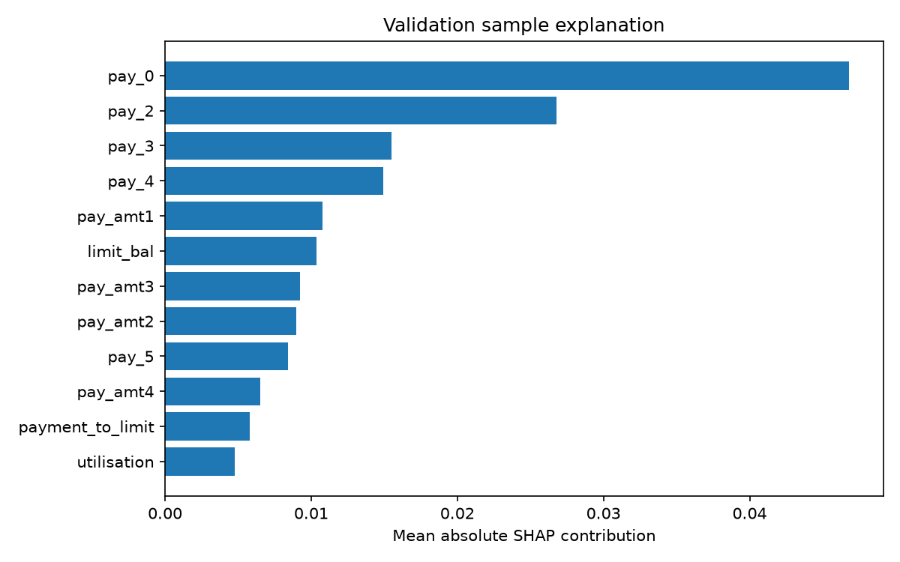

# Model card — reference run

This card describes the executed UCI reference run bundled with this release.
Your rerun creates its own reports in reports/model and MLflow; it does not
silently overwrite these reference claims.

## Intended use and exclusions
Demonstrate reproducible training and governed artifact lifecycle engineering.
Not approved for lending decisions, customer eligibility, fraud accusations or
present-day UAE financial prediction. The historical source is Taiwan credit-card
clients, 2005, with a next-month default outcome. Source and CC BY 4.0 attribution:
[data provenance](../data/README.md). Demographic features and ID are excluded
from model inputs; financial proxies and historical bias can remain.

## Data and selection
30,000 source rows; default prevalence 22.12%.
Train 17,929, validation 5,974,
test 6,097. There were
817 duplicate financial predictor profiles
beyond their first occurrence; profile groups were kept within partitions.
19 financial inputs plus three deterministic engineered ratios. No imputation.
Full pipeline preprocessing is fitted only on training/CV data.

Selected algorithm: **random_forest**. Parameters:
`{"max_depth": 6, "min_samples_leaf": 15, "n_estimators": 80, "n_jobs": 2, "random_state": 42}`.
Threshold: **0.20**, selected on validation for recall >= 0.65
then maximum precision. Test data were not used in model/threshold selection.
PR-AUC throughout means average precision.

| Metric | Validation | Test |
|---|---:|---:|
| roc_auc | 0.7855 | 0.7847 |
| pr_auc | 0.5638 | 0.5801 |
| accuracy | 0.7457 | 0.7433 |
| precision | 0.4528 | 0.4611 |
| recall | 0.6522 | 0.6660 |
| f1 | 0.5345 | 0.5449 |
| brier | 0.1364 | 0.1377 |

| Model | C / max depth / leaves | Train CV AP mean | Train CV AP std |
|---|---:|---:|---:|
| logistic | 0.1 | 0.4957 | 0.0158 |
| logistic | 1.0 | 0.4955 | 0.0155 |
| random_forest | 6 | 0.5412 | 0.0064 |
| random_forest | 12 | 0.5411 | 0.0077 |
| lightgbm | 15 | 0.5410 | 0.0034 |
| lightgbm | 31 | 0.5341 | 0.0042 |

The threshold favors recall; test precision is 46.1%, so
many positive classifications are false positives. No business cost or legal
acceptability claim follows from these figures. Calibration was evaluated via
Brier score and quantile-bin curves; no post-hoc calibrator was deployed.

## Explainability and subgroup diagnostics

SHAP describes model associations, not causality. These contributions are for a
small deterministic validation sample; units depend on the model's output space.
The report includes sex/age groups, support counts, recall, FPR/FNR and Brier.
Validation sex-group recall gap: 0.0011.
This one diagnostic does not establish fairness; uncertainty in small groups,
proxy effects and transfer limitations remain. See responsible_ai.md.

## Runtime measurement and registry outcome
Measured single-row in-process P50/P95/P99:
12.49 / 13.86 / 20.82 ms.
30 repetitions after warm-up; two model
worker threads. Environment: `Linux-6.18.44-x86_64-with-glibc2.39`,
Python 3.12.14. CPU identifier was
`x86_64`.
This is not API latency or a load benchmark; deployment hardware must be measured.
Artifact size, including packaged code and metadata: 722,996 bytes.

Actual registry result: **PROMOTE**, version
1; approved artifact reloaded successfully over the
MLflow HTTP artifact proxy. All default validation guardrails passed.

## Provenance and limits
Run `5e69a1c31e0042a39d2304b16183661e`; dataset `f6d615e9f3f5dfb6a906`.
Created `2026-09-17T08:27:44.638676+00:00`. Git SHA is `uncommitted`;
source-code digest `cac1df8e9a716d4374ee4c1263cb908c6f8eaecb5334838a4ba116240df890de` records this unhosted
checkout. Configuration, dataset hashes and dependencies are in candidate.json.
All model-generated numbers above come from that report. Registry audit and
HTTP verification are included alongside it. Rollback and rejection were tested
in isolated real MLflow registries using explicitly synthetic fixtures.

This reference evaluation predates the monitoring/retraining implementation. Later milestones
add those capabilities and isolated verification, not live customer outcomes. Distribution
changes require investigation and independently validated rollout.

## Serving and retraining update (0.3.0)

Milestones 6–8 add prediction/explanation endpoints, vectorized CSV scoring,
version-specific monitoring and gated retraining around this approved artifact.
The historical metrics above remain the original evaluation; synthetic monitoring
scenarios are not additional real-world validation. Individual explanations show
feature contributions with explicit probability/log-odds units and a reconstruction
check. See `batch-2-report.md` for measured HTTP latency and its SQLite/local-runtime
scope, and `batch-2-guide.md` for delayed-label and retraining limitations.

## Portfolio evidence

[Benchmarking](benchmark-report.md) separates in-process timing from HTTP timing.
[Monitoring](monitoring-report.md) records simulation outcomes and evidence-sufficiency rules.
Regenerate current local evidence using `scripts/collect_portfolio_evidence.py --benchmark`;
every new measurement keeps its own date, environment and model identity.
The [22 September local evidence](verification/portfolio/evidence.json) has its own serving
run identity and contains no observed labels; it does not re-verify the quality metrics above.
[AWS deployment](milestone-10-report.md) remains incomplete after CloudFront verification was declined.
